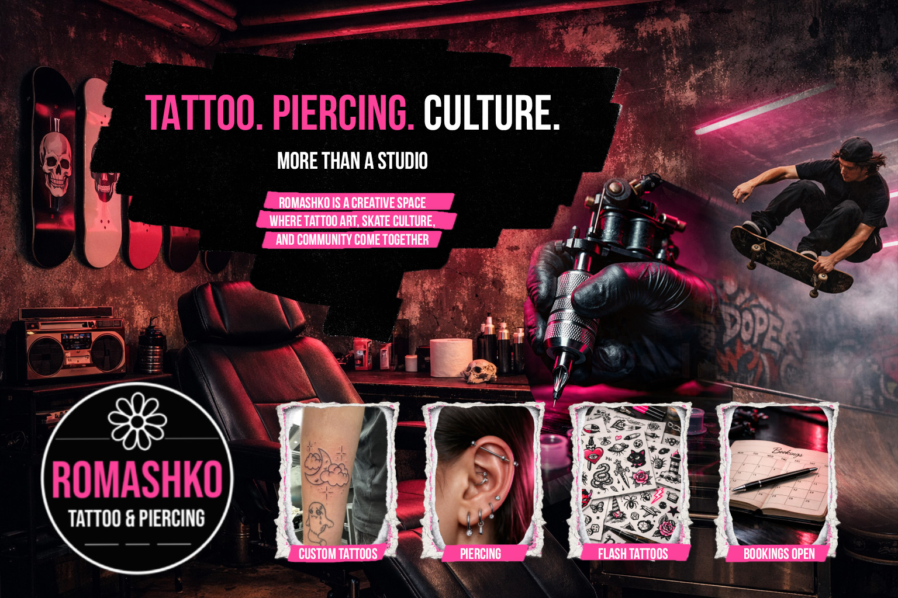

# Kirs_M_FIP

## Romashko Tattoo & Piercing Studio Website

## Overview  
This project is a website for my tattoo and piercing studio - Romashko Tattoo & Piercing Studio. The idea of the studio is inspired by underground skate culture, tattoo artistry, neon lighting, and community. The goal was to make something that shows the brand identity, the artists, the tattoo styles, and the overall atmosphere of the studio and streets.

I built this project to practice creating a fully responsive website with a strong visual identity. I also wanted to improve how I organize content, work with styling systems in SASS, and make the page feel more interactive with JavaScript and GreenSock animations.

On this website users can explore the different sections of the studio, learn about the brand, see the tattoo styles we are offering and check the artist portfolio pages. Also get inspired to get a flash tattoo for only 70$. I also added the contact form and a custom video player to make the homepage feel more dynamic and interesting and cool in general.

---

## Features  
- Responsive design from mobile to desktop  
- Custom header with navigation and hamburger menu  
- Smooth scrolling navigation  
- Hero section  
- Custom video player with controls  
- About section explaining the studio concept  
- Styles section with different tattoo styles we are offering  
- Artists section with links to their portfolios 
- Separate artist portfolio pages for three artists  
- Studio section describing the environment and concept  
- Flash tattoo section 
- Contact form  
- Footer with navigation, social icons and studio details  
- GreenSock scroll animations for main sections  

---

## Tech Stack 
- **Backend:** Laravel
- **Frontend:** HTML, SASS, JavaScript, Vue  
- **Animation:** GSAP   
- **Version Control:** Git & GitHub  

---

## Structure  
The project includes:

- A responsive header  
- A hero section  
- A custom video player section  
- An about section  
- A styles section  
- An artists section  
- Separate artist portfolio pages  
- A studio section  
- A flash tattoos section  
- A contact section  
- A responsive footer  
- Separate JavaScript modules for app logic, header menu functionality, animations, video player, and Smooth Scroll  

---

## Purpose  
This assignment was created to:  
- Create a strong visual identity for a fictional studio 
- Practice building a complete responsive brand website   
- Improve working with SASS variables and reusable section styles  
- Practice responsive layouts with the grid system  
- Add interactivity with JavaScript and Vue and Laravel 
- Add animation and smooth scroll to improve the user experience  
- Build a website that feels more creative 

---

## Installation  
No installation is required for the front-end part.  

To run the project properly, open it in a local browser environment. If the artist gallery pages use dynamic Vue data from a local backend, the backend should also be running so the images can load correctly.

---

## Usage  
Open the website in a browser and navigate through the different sections using the header or footer navigation. Users can explore the studio concept, check the artists, open artist portfolio pages, watch the intro video, and use the contact form section.

---

## Credits  
Mikhail Kirs  

## License  
MIT License  

**Contact:**  
- [topkun6666@gmail.com](mailto:topkun6666@gmail.com)  
- +1 (226) 224-6074  
- [GitHub Profile](https://github.com/Mikki667)  
- [My Portfolio](https://michaelkirsweb.ca/) 
